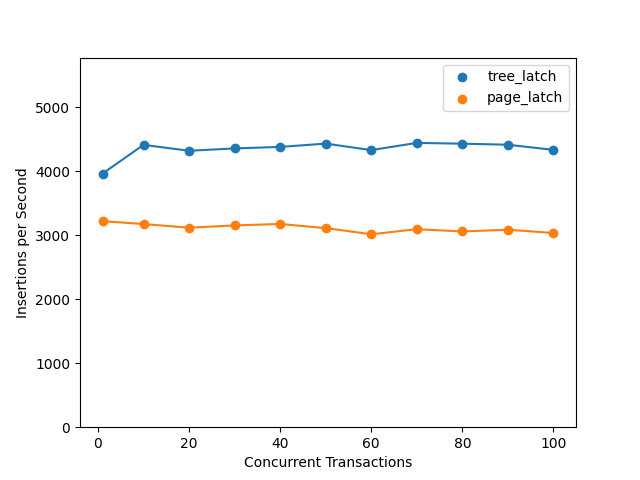

# small-db

[](https://github.com/small-db/small-db/actions/workflows/test.yml)
[](https://docs.rs/small-db)

A small database.

**Thanks for your attention. For any issues/bugs/thoughts, please feel free to open an [issue](https://github.com/small-db/small-db/issues) or send an email to [Xiaochen Cui](mailto:jcnlcxc.new@gmail.com)**

## Quick Start

### Start a Server

```bash
# this will start a server on port 5433, which is compatible with PostgreSQL
make run
```

### Connect to the Server

```bash
psql -h localhost -p 5433 -d default_db -U xiaochen
```

## Features

### Two Types of Latch Strategies

- **page-latch** strategy (each page has its own latch)
- **tree-latch** strategy (each leaf page has its own latch, and all other pages are protected by a tree latch. MySQL InnoDB uses this strategy.)



### Four Types of ARIES Log Recovery Algorithms

- **steal + no-force**
- **no-steal + no-force**
- **steal + force**
- **no-steal + force**

Explanation:

- "STEAL" means that a page can be written to the permanent database on nonvolatile storage before the transaction commits.
- "NO-STEAL" means it cannot.
- "FORCE" means a transaction is not allowed to commit until all pages modified by it are written to the permanent version of the database.
- "NO-FORCE" means it can.

### Three Concurrency Control Algorithms

- **pessimistic concurrency control**
- **optimistic concurrency control**
- **mvcc (multi-version concurrency control)**

### Four Isolation Levels

- **read uncommitted**
- **read committed**
- **repeatable read (snapshot isolation)**
- **serializable**

## Test

<!-- [COMPILATION OPTIONS START] -->
[](https://github.com/small-db/small-db/actions/workflows/test_tree_latch_aries_steal_aries_force_read_uncommitted.yml)

[](https://github.com/small-db/small-db/actions/workflows/test_tree_latch_aries_steal_aries_force_read_committed.yml)

[](https://github.com/small-db/small-db/actions/workflows/test_tree_latch_aries_steal_aries_force_repeatable_read.yml)

[](https://github.com/small-db/small-db/actions/workflows/test_tree_latch_aries_steal_aries_force_serializable.yml)

[](https://github.com/small-db/small-db/actions/workflows/test_tree_latch_aries_steal_aries_no_force_read_uncommitted.yml)

[](https://github.com/small-db/small-db/actions/workflows/test_tree_latch_aries_steal_aries_no_force_read_committed.yml)

[](https://github.com/small-db/small-db/actions/workflows/test_tree_latch_aries_steal_aries_no_force_repeatable_read.yml)

[](https://github.com/small-db/small-db/actions/workflows/test_tree_latch_aries_steal_aries_no_force_serializable.yml)

[](https://github.com/small-db/small-db/actions/workflows/test_tree_latch_aries_no_steal_aries_force_read_uncommitted.yml)

[](https://github.com/small-db/small-db/actions/workflows/test_tree_latch_aries_no_steal_aries_force_read_committed.yml)

[](https://github.com/small-db/small-db/actions/workflows/test_tree_latch_aries_no_steal_aries_force_repeatable_read.yml)

[](https://github.com/small-db/small-db/actions/workflows/test_tree_latch_aries_no_steal_aries_force_serializable.yml)

[](https://github.com/small-db/small-db/actions/workflows/test_tree_latch_aries_no_steal_aries_no_force_read_uncommitted.yml)

[](https://github.com/small-db/small-db/actions/workflows/test_tree_latch_aries_no_steal_aries_no_force_read_committed.yml)

[](https://github.com/small-db/small-db/actions/workflows/test_tree_latch_aries_no_steal_aries_no_force_repeatable_read.yml)

[](https://github.com/small-db/small-db/actions/workflows/test_tree_latch_aries_no_steal_aries_no_force_serializable.yml)

[](https://github.com/small-db/small-db/actions/workflows/test_page_latch_aries_steal_aries_force_read_uncommitted.yml)

[](https://github.com/small-db/small-db/actions/workflows/test_page_latch_aries_steal_aries_force_read_committed.yml)

[](https://github.com/small-db/small-db/actions/workflows/test_page_latch_aries_steal_aries_force_repeatable_read.yml)

[](https://github.com/small-db/small-db/actions/workflows/test_page_latch_aries_steal_aries_force_serializable.yml)

[](https://github.com/small-db/small-db/actions/workflows/test_page_latch_aries_steal_aries_no_force_read_uncommitted.yml)

[](https://github.com/small-db/small-db/actions/workflows/test_page_latch_aries_steal_aries_no_force_read_committed.yml)

[](https://github.com/small-db/small-db/actions/workflows/test_page_latch_aries_steal_aries_no_force_repeatable_read.yml)

[](https://github.com/small-db/small-db/actions/workflows/test_page_latch_aries_steal_aries_no_force_serializable.yml)

[](https://github.com/small-db/small-db/actions/workflows/test_page_latch_aries_no_steal_aries_force_read_uncommitted.yml)

[](https://github.com/small-db/small-db/actions/workflows/test_page_latch_aries_no_steal_aries_force_read_committed.yml)

[](https://github.com/small-db/small-db/actions/workflows/test_page_latch_aries_no_steal_aries_force_repeatable_read.yml)

[](https://github.com/small-db/small-db/actions/workflows/test_page_latch_aries_no_steal_aries_force_serializable.yml)

[](https://github.com/small-db/small-db/actions/workflows/test_page_latch_aries_no_steal_aries_no_force_read_uncommitted.yml)

[](https://github.com/small-db/small-db/actions/workflows/test_page_latch_aries_no_steal_aries_no_force_read_committed.yml)

[](https://github.com/small-db/small-db/actions/workflows/test_page_latch_aries_no_steal_aries_no_force_repeatable_read.yml)

[](https://github.com/small-db/small-db/actions/workflows/test_page_latch_aries_no_steal_aries_no_force_serializable.yml)

<!-- [COMPILATION OPTIONS END] -->

## Development

### Run all tests

```bash
make test
```

Run all tests, this will be run in the CI. Log lovel is "info".

### Run a specific test

```bash
make <test_name>
# e.g:
make test_big_table
# Note: the test name must has the prefix "test_".
```

Run a specific test and store the output to file "out". Log level is "debug".

### Trace a specific test

- linux

  ```bash
  ./scripts/trace.sh <test_path>

  # e.g:
  ./scripts/trace.sh integretions::btree_test::test_big_table
  ```

- macOS

  ```bash
  CARGO_PROFILE_BENCH_DEBUG=true sudo cargo flamegraph --test <target> -- <test_path>

  # e.g:
  CARGO_PROFILE_BENCH_DEBUG=true sudo cargo flamegraph --test small_tests -- integretions::btree_test::test_concurrent
  ```

## Q&A

### Latch & Lock

- How many types of latches/locks are there in the current implementation?

  1. Page latch (protects a page's content)
  2. Tree latch (protects the tree structure)
  3. "RWLock" on every page (protects a page's content)
  (Need a more precise definition.)

- What's the difference between a latch and a lock?

  Latches are used to guarantee physical consistency of data, while locks are used to assure logical consistency of data.
  (Need a more precise definition.)

- Do we have to release the latch on a page manually?

  It depends on the page category.

  - For the leaf page, we have to release the latch manually, so that other transactions can access the page (before the current transaction commits).
  - For the internal page, we shouldn't release the latch manually. In "tree-latch" mode, there is no latch on the internal page. In "page-latch" mode, the latch on the internal page is also used to prevent deadlocks.
  - For the root pointer page and header page, we can release the latch manually to shrink the scope of the latch. But we have to be careful about the operation on these pages to avoid deadlocks. (Specifically, we have to make the scope of the latch as small as possible.)
  (Need a more precise definition.)

- Why the "tree-latch" strategy is faster than the "page-latch" strategy?

  Because the "tree-latch" strategy has fewer latches request and release actions.

### Broad Questions

- Why do we choose Rust as the implementation language?

  - Golang has a simpler syntax, but will cause more concurrency bugs (more specifically, "data race" bugs).
  - C++ is harder to debug and maintain. (Especially when you don't have thoes great C++ tools in Google.)
  - Learning Rust. (If you want to do system programming but don't like C++, Rust and Golang are the best choices.)

- What's my strategy on database learning?

  - Use the "small-db" project as a playground to understand fundamental database concepts.
  - Browse the source code of other databases casually to gain insipiration and knowledge. Currently, I'm browsing the source code of "MySQL", "PostgreSQL", "CockroachDB" and "SQLite".
  - Try to contribute to other databases to interact with the community. Currently, I'm trying to contribute to "CockroachDB".

## Notes

### the simplified version of the B+ tree latch strategy

- no tree latch
- when accessing a page (either leaf or internal), all ancestor pages of the page must be latched (why? if not latched, two directions of tree-traversal may happen at the same time, and lead to a deadlock)

### the imitate-mysql version of the B+ tree latch strategy

- there is a tree latch protecting the tree (all pages except leaf pages)

### MVCC (Multi-Version Concurrency Control)

- each transaction has a unique transaction id
- each row has a "xmin" and "xmax" field, only transactions with following conditions can see the row:
  - the transaction's id is in the range of [xmin, xmax)
  - the row should be committed (in the current implementation, it means the page which contains the row is not a dirty page)
- when a transaction create a row, it sets "xmin" to its own id, so it can see the row

### questions about mysql

- what is "bufferfixed"?
- what is "fsp latch"?

### Draft

What's the exact meaning of "flash a page"?
It means that the modified page is written to the disk, thus ensuring the durability of the data. (Durability
means the data is not lost even if the system crashes.)

Why we have to flash related pages in the beginning of the transaction commit?
To ensure the durability of the data. Durability is the requirement of the transaction.

During flashing, the first step is to write an "update log" to the log file, why?
So that the system can recover the data in the page if the system crashes before the write operation is completed.

If the tree is protected by a tree latch, do we still have to flash internal pages?
Yes, because the internal pages may be modified by the transaction. And we need to record the changes in the log file. Actually, we need to record the changes of all pages no matter which latch strategy is used. If you just change a page without recording to the log file, the system will not be able to recover the data in the page if the system crashes before the write operation is completed.

If the tree is protected by a tree latch, do we still have to record the relationship between transaction and internal pages?
Yes, but we only have to record modified internal pages.

What's the best way to record dirty pages (pages that have been modified by a transaction)?
Since a transaction only use one thread in the current implementation, we pass dirty pages as a parameter. If we use
multiple threads for a transaction in the future, a better approach have to be used.
But different with repo "simple-db-hw-2022", we store dirty pages in the "transaction" context instead of using a standalone "dirty pages" parameter.

Why should I record its own starting offset at the end of each log record?
So the log manager can read the log file in reverse order.

Why the log manager need to read the log file in reverse order?
TODO

What's the best way to record the relationship between transaction and its dirty pages?
Due to the existence of the "flash_all" api, we must record the relationship globally, so we can get the
transaction of a dirty page when we flash all pages.

Why do we need "flash_all" api, and when should we use it?
TODO

When there is a tree latch, do we still need the lock manager ("ConcurrentStatus")?
Yes, since the "RWLock" is not enough to protect a leaf page from being modified by other transactions. The lock
from the lock manager and the "RWLock" attached to the leaf page have different life time. (The life time of the lock
from the lock manager is longer.)

Define "before image" precisely.
The "before image" is the content of a page before the transaction accesses it.
(Note it's not the content before the transaction starts, since other transactions may commit after
the transaction starts but before the transaction accesses the page, and these changes are "durable".)

Define "after image" precisely.
TODO

What's the transaction isolation strategy of the current implementation?
TODO

What's the transaction isolation level of the current implementation?
It's "READ UNCOMMITTED", which means a transaction can read the uncommitted data of other transactions.

When comes to the relationship between the transaction and the pages, why there are too fields ("hold_pages"
and "dirty_pages")?
"hold_pages" records all leaf pages that locked by the transaction, and "dirty_pages" records all
pages that have been modified by the transaction. (In the current implementation, "hold_pages" is a subset of "dirty_pages".)

(In InnoDB latch approach) What happens if a inner page is modified by another transaction, after the X-Latch
is released by the current transaction?
TODO

We need "s_lock_map" and "x_lock_map" no matter which latch strategy is used.
This is because the lock semantics expressed by s/x lock map is different from
the "RwLock" of the page itself. And the scope of s/x lock is usually larger than
the "RwLock" of the page.

For example, in the following scenario:
step 1: a tx acquire a X-Latch on a page (for insert)
step 2: some other actions
step 3: the tx access the page by `write().wrap()`
Without the restriction of s/x lock map, the page may be modified by other txs
between step 1 and step 3, which is not allowed.

And "RwLock" lock is also necessary since it provides interior mutability for the
page itself.

Question: what is an internal(or root_ptr, header) page being modified by a transaction? should we record the
"UPDATE" action in the log file when committing the transaction (or even earlier, when the page is modified)?

## Status

- [ ] expand header pages when needed (e.g: when creating new pages)

- [ ] Test system crash immediately after the transaction commits (for the "no-force" tx mode)
- [ ] Add "redo" action
- [ ] Enable error logs in the buffer pool and dig deep

- [ ] Variable length field
- [x] PostgreSQL protocol
- [ ] Index (B+ tree)
  - [x] clustered index (InnoDB flavor, index organized tables) (<https://dev.mysql.com/doc/refman/8.0/en/innodb-index-types.html>)
  - [ ] all-secondary indexes (PostgreSQL flavor, heap organized tables) (<https://rcoh.me/posts/postgres-indexes-under-the-hood/>) (<https://www.postgresql.org/docs/current/btree-implementation.html>)
  - [ ] support table with no primary key
- [x] Buffer pool
- [ ] WAL (Write ahead log)
  - [x] ARIES
  - [ ] Innodb
  - [ ] PostgreSQL
- [ ] Gap Lock
- [ ] TPCC benchmark
- [ ] MVCC (Multi-version concurrency control)
- [ ] Optimistic concurrency control
- [ ] Pessimistic concurrency control
- [ ] Snapshot isolation
- [ ] Distributed transaction
- [ ] Distributed lock
- [ ] Distributed index

### Non-functional targets

- [ ] Code coverage (<https://blog.rng0.io/how-to-do-code-coverage-in-rust>)
