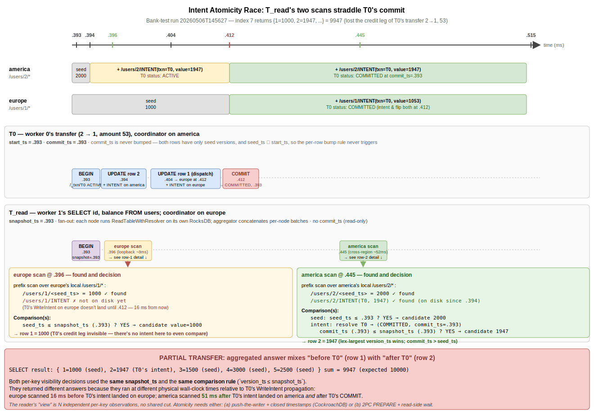

# Intent Atomicity Race (Notes)

> **Status:** scratch notes from the 2026-05-06 Jepsen run on commit `a61c31c`
> ("feat(txn): lazy intent promotion + ACTIVE-abort"). Not in `SUMMARY.md`.
> Promote / restructure into a proper chapter when ready.

## What Was Run

```bash
cd small-db-jepsen && lein run test-all \
    --node america --node europe --node asia \
    --ssh-private-key ~/.vagrant.d/insecure_private_key \
    --username vagrant
```

`lein run test-all` against `:bank` test (5 accounts, total `10000`, 60s time-limit, 100 ops cap, 3 workers). Exit 1, 1 failure. Log: `small-db-jepsen/store/bank-test/20260506T145627.472-0700/`.

## Failure Summary

```
:bank {:valid? false,
       :read-count 52,
       :error-count 15,
       :errors {:wrong-total {:count 15, :lowest 9928, :highest 10078, ...}}}
```

15 `:wrong-total` reads observed (totals ranging 9928 to 10078 vs. expected 10000). 15 transfers failed with `:fail :transfer ... active intent on .../X for txn_id=Y; retry`. The two counts coincidentally equal — they are independent failure modes.

## Mode 1: ACTIVE-Aborts (caused by this commit)

**Symptom.** Workers see errors like:

```
INTERNAL: failed to update into server america:50001:
active intent on default_schema.users/2 for txn_id=310535604194947072; retry
```

The runner's `try`/`catch` issues `ROLLBACK`, marks the op `:fail`. Jepsen treats `:fail` as definitively-not-applied, so these don't directly create wrong-total reads. They are operational noise, not corruption.

**Why it fires.** `latest_committed_version_ts` (in `src/txn/txn.cc`) now returns `AbortedError` on `ResolveIntentResponse::ACTIVE`, where the prior code logged a warning and continued (silently overwriting the in-flight intent — a real data-loss bug the abort closes). Under sustained concurrency, two writers regularly hit the same row in the window between writer A releasing its row lock and writer A's coordinator flipping the txn record to `COMMITTED`. The chapter `write_intents.md` calls this out: "the row lock plus single-owner-per-row partitioning means any intent on R belongs to a transaction that has released its lock, and a transaction that has released its lock has flipped its status. The case still has to be handled, because a coordinator that crashed between writing intents and flipping its txn record leaves a stale ACTIVE record behind." In practice that "still has to be handled" case fires routinely under three concurrent workers, not only after a coordinator crash.

**Verdict.** Correct behavior given the chosen semantics (abort on ACTIVE). Annoying frequency. Two ways to make it less noisy without re-introducing the data-loss bug:

- **Wait + retry on ACTIVE.** A short bounded wait with a re-check would absorb the common case (writer A is about to flip COMMITTED) without bouncing the client. Stops short of full waiter queues.
- **Hold the row lock until COMMIT/ROLLBACK** (as `write_intents.md` originally described under TxnState's `held_locks`, but which the current code does *not* do — the lock is released at the end of `update()`). Closes the same-row window entirely. Requires either threading the lock through `Txn` state on the row's owner across gRPC calls, or having the coordinator drive an explicit BEGIN/COMMIT RPC against each owner. Substantial protocol change.

## Mode 2: `:wrong-total` Reads (NOT caused by this commit)

**Symptom.** A `:read` returns balances summing to ≠ 10000. First failure was index 7:

```
{:index 7, :time 20292595245, :type :ok, :process 1, :f :read,
 :value {1 1000, 3 1500, 2 1947, 4 3000, 5 2500}}    ; sum 9947
```

Bracketing context (from `history.txt`):

```
{:index 0, :time 20166100743, :type :invoke, :process 0, :f :transfer, :value {:from 2, :to 1, :amount 53}}
{:index 1, :time 20168109420, :type :invoke, :process 1, :f :read}
{:index 3, :time 20190463869, :type :ok,     :process 0, :f :transfer, :value {:from 2, :to 1, :amount 53}}
{:index 5, :time 20288774321, :type :ok,     :process 2, :f :read,
   :value {4 3000, 5 2500, 1 1053, 3 1500, 2 1947}}   ; sum 10000 — full transfer visible
{:index 7, :time 20292595245, :type :ok,     :process 1, :f :read,
   :value {1 1000, 3 1500, 2 1947, 4 3000, 5 2500}}   ; sum  9947 — only debit visible
```

Worker 0's transfer `2→1, 53` succeeded; worker 2 (asia) saw both legs (`{1=1053, 2=1947}`); 4 ms later, worker 1 (europe) saw only the debit (`{1=1000, 2=1947}`).

**Trace (server-side, single millisecond resolution).**

| Time | Node    | Event |
|------|---------|-------|
| .393 | america | T0 BEGIN (writes `/_txn/<T0>` ACTIVE) |
| .393 | europe  | worker 1's `SELECT` arrives, dispatch begins |
| .394 | america | T0 UPDATE row 2 → WriteIntent `/users/2/INTENT(T0)` |
| **.396** | **europe**  | **worker 1's europe-loopback scan runs (snapshot_ts=.393)** |
| .404 | america | T0 UPDATE row 1 dispatched to all peers |
| .412 | america | T0 SetTxnStatus(COMMITTED, commit_ts=.393) |
| .412 | europe  | T0's UPDATE-row-1 dispatch arrives → WriteIntent `/users/1/INTENT(T0)` |
| **.445** | **america** | **worker 1's america cross-region scan runs (snapshot_ts=.393)** |
| .515 | client  | worker 1's `:ok :read` reported |

The two starred lines are the smoking gun. `dispatch=false` log lines (server.log query.cc:118) confirm both timestamps:

```
europe   .396  query: dispatch=false snapshot_ts=1778104657393   (= worker 1's BEGIN, .393)
america  .445  query: dispatch=false snapshot_ts=1778104657393
```

Same `SELECT`, same `snapshot_ts`. The two local scans ran 49 ms apart — the gap was wide enough for *all* of T0's transfer (UPDATE/dispatch/COMMIT) to land inside it.

**The race.** Atomic from worker 0's perspective; non-atomic from worker 1's perspective:

- **europe scan at .396 reads `/users/1/*`.** At that wall-clock moment the only key under that prefix is the seed (`/users/1/<seed_ts> = 1000`). T0's UPDATE-row-1 hasn't even been dispatched from america yet; T0's intent doesn't exist on europe until .412. Result: row 1 = seed = **1000**. T0's credit invisible.
- **america scan at .445 reads `/users/2/*`.** At that wall-clock moment T0's intent has been on disk since .394, and T0 flipped to COMMITTED at .412. Resolver lookup of `/_txn/<T0>` (loopback, micro-second) returns COMMITTED at commit_ts=.393. Result: row 2 = intent value = **1947**. T0's debit visible.

`{row 1 = 1000, row 2 = 1947}` — the credit leg is invisible while the debit leg is visible. Total 9947, lost 53.

**Why one scan ran so much earlier than the other.** Both scans are triggered by the same `SELECT` dispatched from europe at .393. Europe's loopback dispatch reaches its own query handler in ~3 ms (.396). The cross-region dispatch europe→america takes 52 ms in this run (.393→.445) — gRPC channel/connection setup, queueing, etc. T0's whole transfer (BEGIN→COMMIT, .393→.412 ≈ 19 ms) and the row-1 dispatch (.404→.412 ≈ 8 ms more) fit comfortably inside that 52 ms gap.

Worker 2 at index 5 (4 ms earlier `:ok` time but luckier scan timing — its europe scan ran at .444, after .412) saw both legs.

**The flip side: net-positive reads.** Run 2 (`20260506T170618`) skewed almost entirely toward `:wrong-total > 10000`. Same race, opposite asymmetry: in those reads the *credit* leg was visible while the *debit* leg's scan ran too early. Symmetric phenomenon, same fix space.

**This race is not from this commit.** Pre-`a61c31c`, the read-side resolver returned `(false, 0)` for ACTIVE just like it does now (see `default_resolver` in `src/txn/txn.cc`). The atomicity hole is in the read-dispatch itself — different nodes scan their local DB at different wall-clock times, with no shared cut. Confirmed by `git show 1a9635e:src/rocks/rocks.cc` — the read path's behavior on intent resolution is identical. The race has been latent since intents landed.

<p></p>

## Why It Hides on Single-Node and Integration Tests

- **Single-statement integration test** (`scripts/test/test.sh`): one client, sequential statements, COMMIT lands before any subsequent read. No concurrent reader to catch the window.
- **`dirty_read_test`** (unit): explicitly checks ACTIVE → invisible, then COMMIT → visible. Tests the two endpoints of the race; doesn't probe the *transition* under load.
- **`intent_promote_test`** (unit): plants states directly; doesn't drive multi-statement commits across nodes.
- **Bank test under Jepsen**: 3 workers issuing transfers and reads at high rate, intents land on different region owners → cross-region resolver RPCs vs. local resolver RPCs in the same read → the latency asymmetry exposes the window.

## The Underlying Problem

The race isn't really about intents, or 2PC, or our specific protocol. It's a class of problem any distributed read has to face. Stating it precisely:

**Visibility(X, S) should be a pure function of two things:** (a) eternal facts about `X` (its `commit_ts`, its status), and (b) the reader's snapshot `S`. As long as it's a pure function, every per-key call returns the same answer regardless of when it physically runs — so atomicity falls out for free across the N keys a reader touches.

The race we hit happens because today the per-key call also depends on (c) the wall-clock instant at which it runs, for three concrete reasons:

1. **Undecided txn.** `X`'s owning txn has no `commit_ts` yet (mid-flight, no DECISION).
2. **Unpropagated write.** `X` isn't on disk on this node yet (write is in flight). *(This is what bit us in Mode 2 above — europe scanned at .396, T0's intent didn't arrive on europe until .412.)*
3. **Stale resolver lookup.** The status the reader sees for `X` depends on when the resolver call lands relative to `SetTxnStatus`.

Three families of techniques eliminate each cause.

### Family 1 — Force-decision

When a per-key call hits an undecided txn, force the txn to decide before continuing. After a finite wait, every txn the reader touched has a frozen `(commit_ts, status)`. Per-key calls now answer purely from `X`'s eternal facts.

- **Mechanism:** push-the-writer (CockroachDB's `PushTxnRequest`), or wait-on-intent (block until the writer flips).
- **Pairing required:** atomic commit decision (2PC PREPARE + DECISION) so "frozen `commit_ts`" is a meaningful concept — once DECISION is durable, every observer of the txn record agrees on `commit_ts`.
- **Cost:** reader latency under contention; deadlocks (handled with priority / wait-die schemes).
- **Eliminates:** causes #1 and #3.

### Family 2 — Settle-then-read

Push the reader's snapshot back to a moment in the past that every node certifies is settled. Below the certified instant, no new writes appear and no statuses flip — per-key calls trivially return the same answer regardless of when they run.

- **Mechanism:** **closed timestamps** (each shard publishes "I will not admit writes at ts ≤ `T_closed`"). The reader's snapshot is bounded by `min(T_closed across all shards touched)`.
- **Pairing required:** causal / HLC timestamps so the bound is meaningful across nodes despite clock skew.
- **Cost:** read freshness lag (seconds, typically); cannot read your own recent writes from this path — needs Family 1 alongside for that case.
- **Eliminates:** causes #2 and #3.

### Family 3 — Funnel through a single ordering point

Make all writes for a key flow through one node that timestamps them serially. Reads against that node observe writes in their issued order. No race because there is only one observer of "before vs after" for each key.

- **Mechanism:** per-shard leader / Raft leaseholder. Writes go through Raft; the leader's applied-index becomes the per-shard logical instant.
- **Pairing required:** Family 1 or 2 for cross-shard reads (this only solves the within-shard case).
- **Cost:** leader is a single point of serialization (and failure recovery); doesn't directly solve cross-shard atomicity.
- **Eliminates:** cause #3 within a shard. Combined with 2PC across shards: also cause #1.

### Composition

Family 3 solves *single-key* consistency. Families 1 and 2 then compose single-key instants into a *cross-key* shared instant. CockroachDB layers all three:

- Raft per range → Family 3.
- 2PC + push-the-writer → Family 1.
- Closed timestamps → Family 2 (latency optimization that lets readers skip the push when their snapshot is far enough back).

Each family alone has a hole. The combination is what gives serializable isolation cheaply in the common case.

### The lower bound

You cannot eliminate all of (1), (2), (3) without *some* coordination between writers and readers. The choice is *where* to pay it:

| Pay at        | What gets expensive |
|---------------|---------------------|
| Write time    | COMMIT is slow — 2PC PREPARE waits for every intent durable on every owner before COMMIT can return. |
| Read time     | Reads block on intents (push) or settle (closed-ts wait). |
| Infrastructure | Every key's activity is pinned through one ordering point (leader); leader becomes a hot spot. |

There is no protocol where writers don't coordinate, readers don't coordinate, and atomicity holds across N independent per-key decisions. That would let two parties learn each others' state with zero communication, which violates information-theoretic limits. You always pay the cost somewhere — what you're choosing is the location.

## Deep Dive: Push-the-Writer

Of the three families above, Family 1 is the most invasive on the read path but the most directly applicable to small-db's current architecture (we don't have leaseholders or closed timestamps to start from). The mechanism is worth a closer look.

### The contract

When a reader's per-key call hits an intent for txn T whose status it cannot resolve to a definite COMMITTED-or-ABORTED, it issues a *push* RPC to T's coordinator. The push completes only after T is in a definitively-decided state — either committed at a frozen `commit_ts`, or aborted. After return, the reader's visibility decision is a pure function of `(T.commit_ts, T.status, R.snapshot_ts)` and no longer depends on when the resolver call physically happened.

This is the moment where cause (1) "undecided txn" stops being a problem for this reader: by definition, after the push returns, T is decided.

### The three push types (CockroachDB's vocabulary)

| Type | Caller wants | What the coordinator does |
|---|---|---|
| `PUSH_TIMESTAMP` | "Move T's `commit_ts` past my `snapshot_ts` so T's intent is invisible to me." | If T can refresh its read set at the new commit_ts, T accepts and moves up. Otherwise T aborts. |
| `PUSH_ABORT` | "Just abort T." | T's status flips to ABORTED. |
| `PUSH_TOUCH` | "Just tell me T's current status, don't force anything." | Returns current status. |

A read encountering an intent normally issues `PUSH_TIMESTAMP`. The semantics are clean: either T moves forward (intent now invisible to the reader) or T aborts (intent invisible because the txn is dead). Either way, the reader gets a definite answer.

A *write* encountering an intent issues `PUSH_ABORT` (if it has higher priority) or waits (if it has lower).

### Priority and conflict resolution

Every txn carries a priority. CockroachDB's default is "older `start_ts` = higher priority", with explicit user-supplied overrides for special cases. When R pushes T:

- **R's priority > T's:** T's coordinator must comply. `PUSH_ABORT` → T flipped to ABORTED. `PUSH_TIMESTAMP` → T accepts the new `commit_ts` (and may need to refresh its read set; if refresh fails because some read it relied on has moved, T aborts).
- **R's priority ≤ T's:** the push fails ("not now") or R is enqueued in T's wait queue and unblocked when T finishes on its own.

This priority scheme is what prevents livelock: there's always a deterministic winner. The shape matches the *wait-die* scheduling discipline (older waits, younger dies on conflict).

### Wait-for graph and deadlock

Pushes register the pusher in the pushee's wait queue. Cycles can form (R waits T, T waits U, U waits R). A periodic deadlock detector walks the graph; if it finds a cycle, the lowest-priority txn in the cycle is aborted. CockroachDB implements this in `pkg/kv/kvserver/concurrency/`.

### STAGING and Parallel Commits

CockroachDB's optimization "Parallel Commits" overlaps PREPARE and DECISION using a `STAGING` status — clients can return `:ok` after one RTT, with readers responsible for *completing the protocol* if they encounter a STAGING txn. A reader that pushes a STAGING txn must run a recovery protocol: check whether every one of T's intents is durably present on its respective range. If yes, force-commit. If no, force-abort. From the pusher's perspective the API is the same; just one more status to handle internally.

### Why push alone doesn't fully fix Mode 2

Push closes causes (1) and (3) but not (2). If a reader's local scan **doesn't even find** T's intent (because the write is still in flight from T's coordinator to this node), there's nothing on disk to push against. So push has to be paired with something on the write side that ensures intents are durable on every owner before COMMIT can be observed:

- **2PC PREPARE** — coordinator's COMMIT only succeeds after every intent is acked durable on every owner.
- **Raft per shard** — a write to a shard isn't acked back to the coordinator until it's Raft-committed (and the leaseholder has applied it).

Either gives the read-side push something to work with. Without one of them, push handles the easy half (already-on-disk intents) and Mode 2 still fires for the in-flight half.

### How small-db could adopt it

Minimal sketch — what it would take to add reader-side push to the current code, without going to full waiter queues / priority schemes:

1. **Extend `TxnService.proto`** with a `PushTxnRequest`:
   - Input: `txn_id`, `push_type` (`TIMESTAMP` / `ABORT` / `TOUCH`), `pusher_priority`, `pusher_snapshot_ts`.
   - Output: `(status, commit_ts)` *after* the push resolves on the coordinator.
2. **Coordinator handler** (`txn::TxnServiceImpl::PushTxn` in `src/txn/txn.cc`):
   - Look up `/_txn/<txn_id>`. If already COMMITTED or ABORTED: return immediately.
   - If ACTIVE and pusher_priority > T's priority: for `PUSH_TIMESTAMP`, atomically bump T's `commit_ts` and mark "must refresh" on the txn record. For `PUSH_ABORT`, `SetTxnStatus(ABORTED)`.
   - If ACTIVE and pusher_priority ≤ T's priority: minimal v0 just returns ACTIVE — pusher decides whether to retry or wait.
3. **Resolver side** (`default_resolver` in `src/txn/txn.cc`): on `ACTIVE`, instead of returning `(false, 0)`, issue `PushTxn(intent.txn_id, PUSH_TIMESTAMP, our_priority, our_snapshot_ts)`. After return, re-decide.
4. **Writer's commit path** (`Txn::Commit` in `src/txn/handle.cc`): before SetTxnStatus(COMMITTED), check the "must refresh" mark; if set, validate that the bumped `commit_ts` is still consistent with what was written. v0 can just abort if marked.

The minimal version (no waiting, no wait-for graph) would already absorb most spurious `active intent` aborts from Mode 1 and the in-already-on-disk subset of Mode 2 misses. The wait queue + deadlock detector is a v1+ refinement; it adds correctness for the case where two txns push each other and deserves its own page once we have the core path.

This is essentially what CockroachDB's `kvserver/concurrency/lock_table.go` and the surrounding wait-queue infrastructure does, in a small fraction of the code.

### Edge cases

The headline mechanism (push → coordinator forces decision → reader applies visibility) is the easy half. The protocol has to handle a long tail of in-the-middle states. Each case named below comes with what the coordinator should return and what the pusher should do.

**1. T has already finished by the time the push arrives.** This is the most common case at scale and the most benign. The coordinator reads `/_txn/<T>`, finds a terminal status (`COMMITTED at commit_ts` or `ABORTED`), and returns it immediately — no priority compare, no flip, no waiting. The pusher applies it normally: COMMITTED → visibility decided by `commit_ts ≤ snapshot_ts`; ABORTED → skip the intent. The push effectively degenerated to a `PUSH_TOUCH` lookup. Worth the network round-trip vs. silently skipping ACTIVE intents because the answer is now correct and durable.

**2. T's record is missing (UNKNOWN).** Coordinator can't find `/_txn/<T>`. Could be: (a) T's `txn_id` was never created here (the intent was tagged with the wrong `coordinator_addr` — bug or corruption); (b) T was created on a different node (not happening if the pusher RPCed the address embedded in the intent, which is what `default_resolver` does); (c) T was GCed long after committing/aborting (a long-deferred sweeper case). Standard convention: treat UNKNOWN as ABORTED. The intent is orphaned; skip it. The risk: case (a) means we lose the actual decision. Mitigation: never GC txn records ahead of intent cleanup, and always trust `intent.coordinator_addr` for the lookup.

**3. T's coordinator crashed mid-flight (orphan ACTIVE).** T's record exists with status ACTIVE; no one will ever flip it on its own. A naive pusher waits forever. Standard fix: **heartbeats** on the txn record. Each active txn updates `last_heartbeat_ts` on its record at a known cadence (CockroachDB does ~1 s). A pusher that sees a heartbeat older than some threshold (~5 s) is allowed to force ABORT regardless of priority — the coordinator is presumed dead. Without heartbeats you have no way to distinguish "T is slow" from "T's coordinator died" — and you must pick a fixed timeout, which costs correctness or progress.

**4. T is in STAGING (Parallel Commits).** Pusher discovers T is STAGING. T's status doesn't decide on its own — the protocol expects whoever observes it (a pusher, a recovery scan) to **complete the protocol**: walk T's `intent_keys`, RPC each owner, and check that every intent is durably present at the expected `commit_ts`. All present → force COMMITTED. Any missing → force ABORTED. Cost is O(|T's writes|) RPCs per recovery run. Multiple concurrent pushers can race the recovery; the txn record's range serializes the final flip so only one decision sticks.

**5. `PUSH_TIMESTAMP` succeeds but T can't actually commit at the new `commit_ts`.** Pusher bumped T from `.393` to `.700` to make T's intent invisible at the pusher's snapshot. Now T tries to COMMIT. Before committing, T must **refresh**: re-validate that every key it read at `.393` still has the same value (or no overwrite) at `.700`. If anything T read has been overwritten in `[.393, .700]`, refresh fails — T must abort, client retries. For small-db: this needs T to record its read-set during execution, which we don't currently do. Without refresh, PUSH_TIMESTAMP is unsafe (a pushed-up T might commit at a `commit_ts` larger than its read set's snapshot, breaking serializability).

**6. Multiple pushers concurrent on the same T.** R₁ and R₂ both push T at roughly the same wall-clock instant. Coordinator serializes via the txn record's range (single-writer). First push lands first, takes its action; later pushers see the post-decision state. No correctness issue; brief contention on the record's range. The serialization point is what makes "the decision" well-defined — even a 1000-way concurrent push results in exactly one transition.

**7. Tied priorities.** R and T both carry priority X. No deterministic winner from priority alone. Tie-break: lower `txn_id` = higher priority (or any deterministic rule), so the system always picks one side. CockroachDB also bumps priorities by a small random amount over time so persistent ties dissolve. Without a tie-break: livelock — both sides retry forever.

**8. Wait-for cycle.** R waits for T (R pushed and T's priority was higher). T waits for R (T independently pushed something R is writing). Cycle. A periodic deadlock detector walks the wait-for graph; on cycle detection, abort the lowest-priority txn in the cycle. Without detection: every txn in the cycle hangs until the request timeout fires, at which point one of them gives up — works in the limit but pays the timeout latency.

**9. Network partition between pusher and coordinator.** Push RPC times out. Pusher retries until success, or eventually returns a retryable error to its client. Two sub-cases by txn-record durability model:

- **Single-node txn record (small-db's current model):** if the coordinator's node is on the wrong side of the partition, T's status is frozen for the duration. The pusher cannot make progress regardless of how long it waits.
- **Quorum-based txn record (CockroachDB Raft):** a surviving quorum on T's range can elect a new leaseholder and accept the push. Pusher's retry succeeds once the new leaseholder is up.

**10. Coordinator failover (CockroachDB-specific).** When the txn record's range loses its leaseholder, a Raft replica takes over. Pushes target the *range*, not a specific node, so failover is transparent to the pusher (a brief window of "service unavailable" retries, then back to normal). Doesn't apply to small-db's single-node txn record model — failover requires quorum replication, which we don't have.

The cases divide into three families by where the work is:

- **Coordinator-side state** (1, 2, 3, 4): coordinator has to track terminal status, missing-record convention, heartbeats, and STAGING recovery — all in the txn record schema.
- **Refresh / read-set tracking** (5): pusher's `PUSH_TIMESTAMP` is only safe if writers track what they read; otherwise the only safe push type is `PUSH_ABORT`.
- **Concurrency control** (6, 7, 8, 9, 10): serialization of decisions, deterministic tie-breaks, deadlock detection, and durability of the txn record under failures.

A v0 implementation in small-db can omit (5)–(10) entirely if it accepts: only `PUSH_ABORT` (no read-set tracking), single-pusher-at-a-time semantics (lock around the txn record write), no priority comparison (always abort the pushee — simple, gives the reader-side what it needs), and trust the `coordinator_addr` (no failover). That's already enough to absorb the spurious `active intent` aborts that motivated this whole discussion. Cases (5)–(10) are the path to production.

## Fix Options

The hole is in the read-dispatch: each node's local scan happens at a different wall-clock instant with no shared cut. `snapshot_ts` is propagated identically to every node, but `snapshot_ts` only filters out writes whose `version_ts > snapshot_ts` — it can't surface a write that hasn't physically landed on this node yet.

1. **Two-phase commit (real 2PC).** Coordinator's `COMMIT` does (a) PREPARE → wait for every intent-bearing peer to ack durably, then (b) DECISION → wait for every peer to ack the status flip. By the time the client sees `:ok`, every node that owns any of T's intents has them on disk *and* the COMMITTED status visible to its resolvers. Two extra RTTs per commit, but it closes both Mode 2 and the spurious aborts of Mode 1. The "right" answer.
2. **Read-path "wait for in-flight writes ≤ snapshot_ts".** Each node tracks a per-shard high-water mark of received-and-applied writes; a scan at `snapshot_ts` blocks until that high-water mark passes `snapshot_ts`. Cheap on the write side, costs reader latency. Doesn't help if the writer hasn't yet *issued* the write toward this node (it has to be in flight for "wait" to mean anything) — needs to be combined with something that delays COMMIT until issue.
3. **Two-phase reads (snapshot consensus).** Coordinator picks `snapshot_ts`, polls all peers ("have you applied everything ≤ S?"), then dispatches the actual scans. Reader-side analog of 2PC. One extra RTT per read.
4. **HLC + commit-wait.** The shadowed-writes chapter's options 2 and 3 — replace wall-clock `commit_ts` with HLC, or add Spanner-style commit-wait. Both make `commit_ts` carry "all causally-prior writes are visible by now" semantics, which combined with read-side wait gives external consistency. Big architectural moves; orthogonal to the per-row mechanics of intents.
5. **Reader block-on-ACTIVE / waiter queues (CockroachDB-style).** Useful but doesn't actually close *this* race — Mode 2 mostly fires when an intent isn't on the local node yet, not when it's there in ACTIVE state. Worth having for the cases where the intent *is* present, and for noise-reduction on Mode 1.

For the book: option 1 (2PC) is the cleanest follow-on chapter — it's a familiar, well-named protocol, it directly closes the failure traced above, and it sets up later distinctions (vs. Paxos commit, vs. coordinated commits, vs. the various workarounds for 2PC's blocking nature). Option 2 alone is interesting as a "minimal local fix" stepping stone if you want to teach that arc first.

## Files / Pointers

- Test result dir: `small-db-jepsen/store/bank-test/20260506T145627.472-0700/` (also `store/latest`).
  - `jepsen.log` — the orchestration log; lines 280, 296, 298 (and 12 others) are the ACTIVE-aborts; full op trace.
  - `history.txt` / `history.edn` — the canonical op sequence; index 7 above came from there.
  - `results.edn` — the checker output reproduced at the top of this note.
  - `<node>/server.log` — per-node small-db logs (binary-ish; use `grep -a`).
- The smoking-gun timestamps from the section above:
  - `america/server.log` → `WriteTxnRecord: /_txn/310535603693486080 status=1 commit_ts=1778104657393` at 14:57:37.412.
  - `europe/server.log` → `WriteIntent: /default_schema.users/1/INTENT txn_id=310535603693486080 coordinator=america:50001` at 14:57:37.412.
- Code touched by this commit: `src/rocks/rocks.{h,cc}` (HalfPromoteIntent / FullPromoteIntent), `src/txn/txn.cc` (`latest_committed_version_ts` -> abort on ACTIVE), `small-db-book/src/distributed_database/write_intents.md` (Promotion subsection, ACTIVE bullet), `test/unit/intent_promote_test.cc` (two new unit tests).
- Pre-existing relevant files: `src/execution/update.cc` (writer path with the lock-release-at-end-of-update behavior), `src/lock/lock_manager.{h,cc}`, `small-db-jepsen/src/small_db_jepsen/runner.clj` (transfer = explicit `BEGIN; UPDATE; UPDATE; COMMIT`).

## Open Questions for the Writeup Pass

- Does the chapter want to introduce both modes together (one is operational, one is correctness), or split? Mode 2 alone makes the cleaner "next chapter" arc since it's the deeper problem.
- Is there an even shorter local mitigation that's worth landing alongside the chapter — e.g. coordinator's COMMIT does a fan-out write of `(/_txn/<id>, COMMITTED)` to every intent-bearing node before returning :ok? That converts every cross-region resolver RPC into a local one. Worth thinking through as a stepping stone before waiter queues.
- The "lock held until COMMIT" gap (Mode 1) is a separate doc-vs-code drift that should probably be either fixed or removed from the chapter; right now `write_intents.md` describes a model the code doesn't implement.
