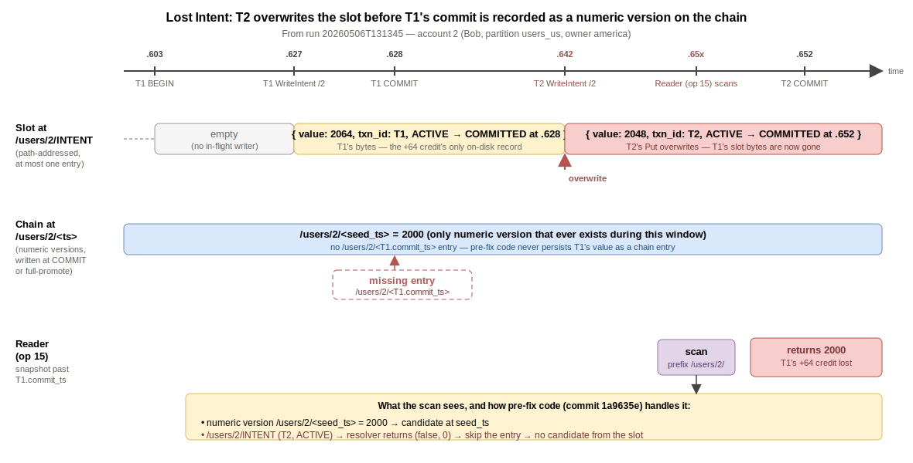

# Lost Intent

A continuation of [Write Intents](./write_intents.md). That page introduces the intent slot at `/<table>/<pk>/INTENT` and a coordinator-side txn record. This page documents a failure mode the slot-based design exposes: a committed transaction's value disappears from a row's MVCC chain because a subsequent writer overwrites the slot before any reader has durably promoted the prior intent.

## The Anomaly

**Behavior.** A transaction `T1` writes to row `R`, returns `:ok` to its client, and the row's new value is briefly visible to some readers. A second transaction `T2` then writes to the same row. While `T2` is in flight, a concurrent reader scans `R` and sees neither `T1`'s nor `T2`'s value -- it sees the value `R` had *before either* transaction. `T1`'s commit has been silently erased from the chain on this row, even though `T1`'s commit record on the coordinator still says `COMMITTED`.

**Root cause.** The intent slot at `/<table>/<pk>/INTENT` is *path-addressed*: the key is a fixed string per row, not a function of the writing transaction. There is at most one intent per row at any time. When a writer `T2` takes the row lock and finds `T1`'s intent in the slot, the writer must do *something* with it -- either persist `T1`'s value as a numeric MVCC version `/<table>/<pk>/<T1.commit_ts>` before laying its own intent, or refuse to proceed. If it does neither and just overwrites the slot, the only durable trace of `T1`'s commit on `R` is now the txn record `/_txn/T1`, which says "T1 committed at `commit_ts = X`" but does not name `R` or carry `R`'s value. A reader scanning `R` sees only the seed and `T2`'s in-flight intent. If the reader treats `T2`'s `ACTIVE` status as "skip this intent" (rather than "abort and retry"), the read returns the seed value -- as if neither commit had ever happened.

**Does this happen in single-server databases?** No. A single server typically stores in-flight writes either as multiple version chains under one row (Postgres tuple-per-version, InnoDB undo log) or as a row-level write buffer keyed by transaction ID. In neither case is there a fixed slot that one writer's bytes overwrite another's. The anomaly is specific to durable, slot-based intent designs: one slot per row, path-addressed, mutated by every writer that takes the row lock. It does not appear in MySQL InnoDB or Postgres at any isolation level on a single node, because the storage format never collapses two writers' state into the same key.

**Does it occur on real distributed databases?** Yes, and several systems have to engineer around it. CockroachDB uses a structurally identical write-intent design (an intent at `<key>/intent`); its writer's `MVCCResolveWriteIntent` runs synchronously when a writer encounters a prior intent, and on `COMMITTED` it atomically writes the resolved version *and* clears the intent before the new writer can lay its own. YugabyteDB pushes provisional records into a distinct keyspace per transaction so two writers' provisional records never collide. Spanner avoids the slot entirely -- writes go through 2PC + Paxos, and an in-flight write occupies a Paxos log entry uniquely identified by the transaction's ID. The shape of the bug only exists when the on-disk write is "one slot, anyone with the lock can overwrite."

**Typical solutions.** Three families:

- **Atomic full-promote at write time.** When the new writer takes the lock and sees a prior `COMMITTED` intent, it persists that intent's value as a numeric version (`Put /<commit_ts>`) and deletes the slot, in one atomic batch, before laying its own intent. The prior commit becomes a permanent part of the row's chain. CockroachDB, FoundationDB.
- **Defensive abort on `ACTIVE`.** If the prior intent's coordinator is still in flight, the new writer must not proceed -- it returns a retryable abort to the client. Combined with the per-row lock, this ensures the second writer never overwrites a slot whose owner hasn't finished. CockroachDB's `WriteIntentError` + `PushTxn` plays this role; without the push protocol it degenerates to "abort and let the client retry."
- **Multi-version intent records.** Use a per-transaction key (`/<table>/<pk>/INTENT/<txn_id>` or a separate provisional-record column family) so two writers' intents physically coexist. Resolution becomes "scan the row's chain of provisionals, resolve each independently." YugabyteDB.

A fourth lighter approach for systems that must keep the slot model: **reader-side half-promote.** Every reader that resolves a `COMMITTED` intent persists its value as a numeric version before continuing. The slot can still be overwritten by the next writer, but by then the prior commit is already on the chain. This bounds the window for the anomaly to "no reader has touched the row between the commits"; it does not close it.

## The Problem (in this system)

Run [`small-db-jepsen/store/bank-test/20260506T131345.793-0700`](../clutter/jepsen.md) failed `:valid? false` with 45 `:wrong-total` errors out of 50 reads. The first error returned a total of `9936`, short by `64`. Walking that read against the history:

- **op 5** (process 0): `transfer {:from 5, :to 2, :amount 64}`. Status `:ok`. The `+64` credit on account 2 is on disk.
- **op 13** (process 1): `:ok :read {1 1000, 3 1500, 2 2064, 4 3000, 5 2436}`. A transient read sees account 2 = `2064` -- proves op 5's credit was visible at this point.
- **op 15** (process 2): `:ok :read {1 1000, 3 1500, 4 3000, 5 2436, 2 2000}`. Total = `9936`. Account 2 = `2000`. The `+64` credit has vanished from this read's view, while op 5's matching debit on account 5 (`5 → 2436`) is still visible.

<p></p>

Account 2 (Bob, country = USA) lives on the `users_us` partition, owned by america. Tracing america's `server.log` from op 5's BEGIN through op 12's first write, with all timestamps from a single coordinator's clock:

```
13:15:06.603  op 5  BEGIN              txn=...344
13:15:06.604  op 5  UPDATE id=5 (-64)   [ intent on /default_schema.users/5/INTENT, off-node ]
13:15:06.627  op 5  UPDATE id=2 (+64)   WriteIntent /default_schema.users/2/INTENT  txn=...344
13:15:06.628  op 5  COMMIT              txn=...344  status=COMMITTED  commit_ts=...506603
13:15:06.628  op 12 BEGIN              txn=...944
13:15:06.642  op 12 UPDATE id=2 (-16)   WriteIntent /default_schema.users/2/INTENT  txn=...944  ◀── overwrites op 5
13:15:06.652  op 12 COMMIT              txn=...944  status=COMMITTED  commit_ts=...506628
```

The second `WriteIntent` at `13:15:06.642` writes to the same RocksDB key as the first. RocksDB's `Put` overwrites by key, so the bytes at `/default_schema.users/2/INTENT` no longer carry `op 5`'s `txn_id` or value -- they carry op 12's. The pre-fix `latest_committed_version_ts` on op 12's writer side resolved op 5's intent, found `COMMITTED`, took its `commit_ts` as the `latest` for the bump check, and otherwise *did nothing on disk*:

```cpp
// src/txn/txn.cc at commit 1a9635e
case ResolveIntentResponse::COMMITTED:
    if (resp.commit_ts() > latest) latest = resp.commit_ts();
    break;
```

No `Put /<commit_ts>`, no `Delete /INTENT`. Op 5's value at `commit_ts = ...506603` exists nowhere on disk except inside op 12's pre-image read (which is in-memory). Op 12's `WriteIntent` overwrites the slot a moment later.

Op 15's read is process 2's `SELECT id, balance FROM users` issued shortly before op 5 even committed and returned long after op 12's intent was in place but before op 12 had flipped its txn record. The pre-fix read path in `ReadTableWithResolver` (also in 1a9635e) walks the prefix, finds the `INTENT` key, calls the resolver, and treats the `false` half of `(bool, int64_t)` (which `ACTIVE`, `ABORTED`, and `UNKNOWN` all return) as "skip this entry":

```cpp
// src/rocks/rocks.cc at commit 1a9635e
auto resolved = resolver(intent);
if (!resolved.ok()) continue;
auto pair = resolved.value();
if (!pair.first) continue;     // ACTIVE / ABORTED / UNKNOWN -> skip
```

Op 15's resolver call against op 12's then-`ACTIVE` txn record returned `(false, 0)`. The scanner skipped the slot. The only remaining entry under `/default_schema.users/2/` was the seed at `2000`. That's the value op 15 returned.

What every layer beneath delivered correctly:

- **Op 5 committed atomically against its own txn record.** `/_txn/...344` reached `COMMITTED` and its `commit_ts` was preserved.
- **The lock manager serialized op 5 and op 12 on account 2.** Op 12's `WriteIntent` ran strictly after op 5's `commit_txn` -- there was no overlapping-write race on the slot itself.
- **Op 12 read op 5's value correctly into its pre-image.** Op 12's debit of 16 was computed from `2064`, not from the seed; if op 12 had subsequently been the only thing observed, account 2 = `2048` would be visible and the bank invariant would hold.

What went wrong: **the on-disk MVCC chain for account 2 had no record of op 5's commit at any moment between op 12's `WriteIntent` (13:15:06.642) and op 12's `commit_txn` (13:15:06.652).** A read that landed in that 10ms window with a snapshot past op 5's `commit_ts` had no way to learn op 5's value. Op 5's effect was lost from this read's perspective, even though both commits succeeded.

## What "Fixing It" Has to Guarantee

The invariant: **before a writer overwrites the intent slot on row `R`, any prior `COMMITTED` intent on `R` must be persisted as a numeric MVCC version on `R`'s chain, and any prior `ACTIVE` intent on `R` must prevent the overwrite outright.**

Equivalently: at every moment in time, every committed transaction `T` that wrote `R` has a durable record of `(T.commit_ts, T's value for R)` somewhere under the prefix `/<table>/<pk>/`. The intent slot is a transient publication channel; the numeric `version_ts` keys are the permanent chain.

This is per-row and writer-driven: the writer holds `lock(R)`, so it is the only party that can mutate the slot, and it has all the information it needs (the prior intent's `txn_id`, the resolution of the prior coordinator's status, the prior intent's value bytes) to write the missing version key before overwriting. Readers don't need the lock and can't safely do the work alone; the writer's atomic batch is what closes the window.

## The Solution Space

### 1. Writer-Side Full-Promote

When a writer takes `lock(R)` and finds a prior `COMMITTED` intent, it issues an atomic write batch of `Put /<table>/<pk>/<commit_ts>` (the prior commit's value as a numeric version) and `Delete /<table>/<pk>/INTENT` (clearing the slot for the writer's own intent). Then it lays its own intent.

| | |
|---|---|
| **Implementation** | One new `RocksDBWrapper` method (`FullPromoteIntent`) that takes a `WriteBatch` with the two ops. A few lines in `latest_committed_version_ts`. |
| **Granularity** | Per-row, per-write |
| **What it fixes** | Lost intent (the `COMMITTED` half) |
| **Cross-node** | No -- runs on the row's owner only |
| **Concurrency cost** | The writer was already taking the row lock and reading the intent; the additional cost is one atomic batch (Put + Delete) |
| **Client visible** | None |

CockroachDB's `MVCCResolveWriteIntent` performs the equivalent step. It's the natural answer when the writer already has the lock and has already done the resolution -- the marginal cost of persisting the result is one batched RocksDB write.

### 2. Defensive Abort on ACTIVE Intent

When the writer's intent-aware read finds a prior intent whose coordinator reports `ACTIVE`, the writer aborts its own transaction with a retryable error. The client retries; by the next attempt either the prior coordinator has finished (`COMMITTED` or `ABORTED`) or its txn record has been cleaned up (`UNKNOWN`).

| | |
|---|---|
| **Implementation** | Replace the existing `SPDLOG_WARN(...)` in the `ACTIVE` branch with `return absl::AbortedError(...)`. |
| **Granularity** | Per-row, per-write |
| **What it fixes** | Lost intent (the `ACTIVE` half -- prior committer was still in flight, so the slot bytes aren't safe to overwrite either) |
| **Cross-node** | No |
| **Concurrency cost** | The aborting transaction's work is wasted; clients see a retryable error |
| **Client visible** | Some `UPDATE`s return `INTERNAL: active intent on .../<pk> for txn_id=...; retry` and the client must reissue. The bank-test client already retries on transient errors, so the visible effect is a few extra round-trips under contention. |

This is the `ACTIVE` counterpart to (1). On its own it doesn't help with `COMMITTED` intents (those need promotion); paired with (1) it covers all live cases.

### 3. Reader-Side Half-Promote

Every reader that resolves an intent to `COMMITTED` issues `Put /<table>/<pk>/<commit_ts> = value` before continuing the scan. The slot is left alone (the reader has no lock and can't safely delete it). On any future read, the prior commit is already a numeric version on the chain.

| | |
|---|---|
| **Implementation** | One new `RocksDBWrapper` method (`HalfPromoteIntent` -- Put only, no Delete). A few lines in `ReadTableWithResolver` and `ReadLatestWithResolver`. |
| **Granularity** | Per-row, per-resolved-intent |
| **What it fixes** | Lost intent **only when a reader has touched the row between the two commits**. Doesn't help when the new writer arrives before any reader has scanned. |
| **Cross-node** | No (reader runs locally, half-promote runs locally) |
| **Concurrency cost** | One `Put` per resolved-intent encountered by a read |
| **Client visible** | None |

Half-promote is lock-free and idempotent (the key is content-addressed by `commit_ts`, the value derives from the txn's permanent `commit_ts`, races on the same Put produce the same byte string). Useful as a complement to (1): on cold rows that a writer hasn't taken in a while, an active reader can still get the prior commit promoted. On its own it cannot guarantee the invariant -- a writer that arrives before any reader has half-promoted recreates the original race.

### 4. Multi-Version Intent Records

Drop the slot model. Each writer stores its intent at a key keyed by `txn_id`: `/<table>/<pk>/INTENT/<txn_id> = { value, coordinator_addr }`. Two writers' intents physically coexist. Resolution becomes: scan the row's chain, find every `INTENT/<txn_id>` entry, resolve each via `coordinator_addr`, treat each like a numeric version once `COMMITTED`.

| | |
|---|---|
| **Implementation** | Wire-format change (intent key shape). Read paths must enumerate intent keys. Garbage collection of resolved-and-old intents required. |
| **Granularity** | Per-row, per-write -- but now multiple intents per row at any time |
| **What it fixes** | Lost intent (the bug doesn't exist if no slot is overwritten) |
| **Cross-node** | No |
| **Concurrency cost** | Read paths walk longer prefixes on contended rows; on quiet rows essentially no overhead |
| **Client visible** | None |

YugabyteDB's design. Eliminates the bug at the data-model level rather than patching the resolution path. The cost is real: every read on a contended row pays for resolving all live intents, garbage-collection for resolved intents becomes mandatory, and the wire format change cascades through the catalog and gossip layers.

### 5. Synchronous Coordinator-Driven Cleanup

At `COMMIT`, the coordinator -- which knows the full set of `intent_keys[]` from `/_txn/<txn_id>` -- issues an explicit `PromoteIntent` RPC to each row's owner before declaring the commit visible. Each owner's RPC handler does the equivalent of `Put /<commit_ts>` + `Delete /INTENT` under the row lock.

| | |
|---|---|
| **Implementation** | New gRPC method; coordinator-side fan-out at `COMMIT`; per-row owner handler |
| **Granularity** | Per-transaction, per-touched-row |
| **What it fixes** | Lost intent |
| **Cross-node** | Yes -- explicit fan-out from coordinator |
| **Concurrency cost** | Commit latency adds one RTT per touched row |
| **Client visible** | Commit is slower under contention; aborted transactions don't pay this cost |

The most thorough answer -- the coordinator owns the cleanup, intents never linger past their author's commit. The cost is a per-row RPC at every commit. Suitable when contention is rare; expensive when most transactions touch many rows.

## Comparison

| Approach | Correctness | Code change | Concurrency cost | Aborts to client? | Cross-node? |
|---|---|---|---|---|---|
| 1. Writer full-promote | Yes | Tiny (~30 lines) | One atomic batch per writer-encountering-prior-intent | No | No |
| 2. Abort on ACTIVE | Yes (paired with 1) | One return statement | Aborted writes; clients retry | Yes (retryable) | No |
| 3. Reader half-promote | Partial | Tiny (~20 lines) | One Put per reader-resolving-intent | No | No |
| 4. Multi-version intents | Yes | Large (wire format) | Longer scans on contended rows | No | No |
| 5. Coordinator cleanup at COMMIT | Yes | Medium (new RPC) | One RTT per row at COMMIT | No | Yes |

Reading the matrix:

- **The slot-overwrite hazard has two halves -- prior `COMMITTED` and prior `ACTIVE`.** Option 1 closes the `COMMITTED` half; option 2 closes the `ACTIVE` half. Together they're the minimum that fully closes the bug without changing the wire format.
- **Option 3 alone is insufficient** -- a writer can still reach the row before any reader has half-promoted. It's useful as a *complement* (faster post-commit chain population on cold rows) but not as a standalone fix.
- **Option 4 (multi-version intents)** is the structural answer; it removes the slot model entirely. Bigger change, but the only one that's invariant by construction. Worth picking if the system later needs other multi-writer-per-row affordances (e.g., concurrent row updates from different transactions on different columns).
- **Option 5 (coordinator cleanup)** is the strongest fix per commit but charges every commit a network RTT. Justifiable when the operation is rare (long-running transactions, large write sets) but punishing for bank-test-shape workloads.

## Implementing Writer Full-Promote + Abort-on-ACTIVE

The fix landed in commit `a61c31c` covers options (1) and (2) together, plus reader-side half-promote (3) as a complement. The minimum set required to close the bug is (1) + (2); (3) is included because the small additional code shrinks the post-commit window where future readers still pay an RPC.

### `RocksDBWrapper` API additions

Two new methods in `src/rocks/rocks.h`:

```cpp
// Reader-side: Put /<table>/<pk>/<commit_ts> = value. Lock-free,
// idempotent, leaves the intent slot untouched.
void HalfPromoteIntent(const std::string& table_name,
                       const std::string& pk, int64_t commit_ts,
                       const std::map<std::string, std::string>& values);

// Writer-side: atomic Put /<commit_ts> + Delete /INTENT. Caller MUST
// hold lock(table, pk) -- the path-addressed Delete races with
// concurrent slot mutation otherwise.
void FullPromoteIntent(const std::string& table_name,
                       const std::string& pk, int64_t commit_ts,
                       const std::map<std::string, std::string>& values);
```

`HalfPromoteIntent` is content-addressed by `commit_ts`, so any number of readers may issue the same `Put` against each other or against `FullPromoteIntent` and the result is identical (same key, same value).

`FullPromoteIntent` is the single atomic batch. The Delete is path-addressed (`/<table>/<pk>/INTENT`), so it would race with a concurrent slot mutation if the caller didn't hold the lock; under the lock there is no race.

### Read path (in `src/txn/txn.cc`)

`latest_committed_version_ts`, called from the writer's pre-image read, now full-promotes:

```cpp
case ResolveIntentResponse::COMMITTED: {
    int64_t commit_ts = resp.commit_ts();
    db->FullPromoteIntent(table_name, pk, commit_ts, intent->values);
    if (commit_ts > latest) latest = commit_ts;
    break;
}
case ResolveIntentResponse::ABORTED:
case ResolveIntentResponse::UNKNOWN:
    // Intent is dead; the caller's WriteIntent will overwrite the slot.
    break;
case ResolveIntentResponse::ACTIVE:
    return absl::AbortedError(absl::StrFormat(
        "active intent on %s/%s for txn_id=%d; retry",
        table_name, pk, intent->txn_id));
```

`COMMITTED` does the full-promote synchronously, before the caller's own `WriteIntent`. By the time the writer overwrites the slot, the prior commit's value is already a numeric version on the chain.

`ACTIVE` returns a retryable abort. The client (the bank-test runner, or any application using small-db) retries the SQL statement; on the retry the racing transaction has either committed or been cleaned up.

The reader path (in `ReadTableWithResolver` / `ReadLatestWithResolver`) is amended to call `HalfPromoteIntent` on `COMMITTED` resolutions. Readers don't take the lock, so they can't full-promote; the half-promote is the most they can safely do.

### Edge cases / scope decisions

- **Coordinator failure between intent and txn-record commit.** Out of scope here. A crashed coordinator leaves an `ACTIVE` txn record stuck forever, which under (2) means writers on the affected rows will abort and retry indefinitely. A future page covers TTL-based reaper / orphan-intent takeover.
- **Push-the-writer.** Industrial systems push the still-running writer to a higher `commit_ts` rather than aborting the new arrival. We chose abort-and-retry because the bank-test client retries cheaply and the protocol surface stays small. Pushing requires a coordinator-side queue and a wakeup protocol that's out of scope.
- **GC of resolved-but-not-yet-cleared slots.** Resolved-`COMMITTED` slots stay on disk after a reader has half-promoted, until a writer takes the row and full-promotes them. On rows with frequent writes the cleanup is amortized to zero; on cold rows the slot lingers. A sweeper that takes the row lock and full-promotes orphaned intents would close the gap; deferred.

### What This Buys (and What It Doesn't)

**Buys.**

- **Lost intent closed.** The on-disk MVCC chain on every row contains a durable record of every committed transaction that wrote that row, before any subsequent writer's intent overwrites the slot. The bank-test trace at `13:15:06.6xx` cannot recur: op 12's writer-side full-promote of op 5's intent runs *before* op 12's `WriteIntent`, so a reader landing in the post-overwrite window finds the numeric version key `/default_schema.users/2/...506603` carrying op 5's value.
- **`ACTIVE` slot stomps closed.** A writer that finds a still-running coordinator's intent in the slot aborts rather than overwriting. The slot's bytes are stable until their author finishes.
- **Per-row commit chain self-densifying.** Writers full-promote on contact, readers half-promote on contact -- so contended rows accumulate numeric versions quickly and minimize the per-read resolve-RPC count.

**Doesn't.**

- **Coordinator failure recovery.** A coordinator that dies between writing intents and flipping its txn record leaves stuck `ACTIVE` records. Under (2), writers on the affected rows abort on every retry. Cleanup needs TTL on `PENDING` records or an explicit recovery protocol; deferred.
- **Long-lived contention.** Under high write contention on a single row, abort-on-`ACTIVE` becomes a pure retry storm -- no progress until one writer happens to win the lock-then-resolve race uncontested. A push protocol or a waiter queue would smooth this; deferred.
- **Read-skew across rows.** The bank test's `wrong-total` errors include a category not closed by this fix: a single read can see different commit-time states across different rows because each row is read independently. That's the [Read Skew](./read_skew.md) anomaly's territory, not this one.

The connection back to [Write Intents](./write_intents.md): that page introduced the slot at `/<table>/<pk>/INTENT` and noted in passing that its mutation requires care. This page is the postmortem of what happens when "care" isn't yet implemented -- a Jepsen run (`20260506T131345`) caught an intent overwrite within milliseconds of the test starting. The fix in `a61c31c` brings the implementation up to the design the original page described.
